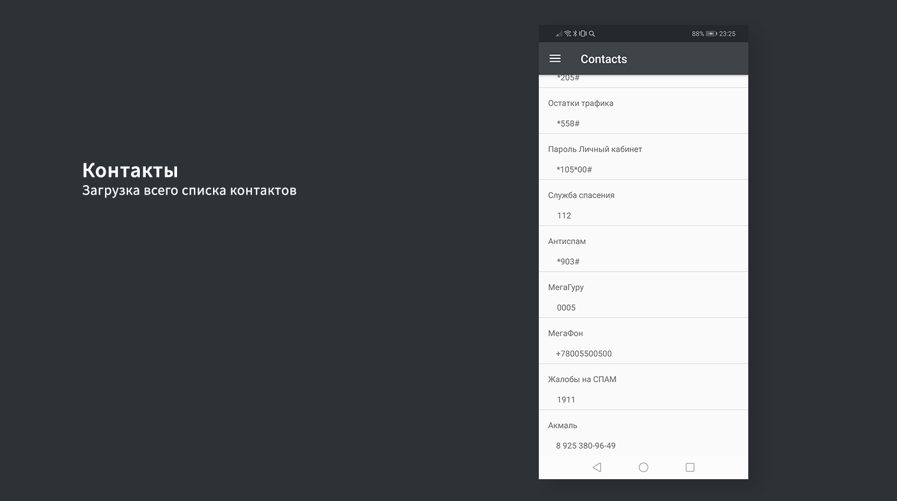

# Техническое задание
Лабораторная работа по дисциплине "Разработка мобильных приложений"

## Основные требования к приложению
Приложение должно включать в себя:

1)	Launch Screen c логотипом МИРЭА
Во время загрузки приложения отображается логотип МИРЭА

2)	Авторизация и выход в Github, а также отображение списка репозиториев
Авторизация в Github и отображение списка своих публичных и приватных репозиториев. Возможность выхода из аккаунта.

3)	Yandex карта с маршрутом от МГУПИ до МИРЭА
С помощью YandexMapKit приложение прокладывает маршрут от МГУПИ до МИРЭА.

4)	Отображение списка контактов
Отображение всего списка контактов

5)	Отображение основной информации об устройстве
Отображение версии Android, брэнда-производителя смартфона, модели процессора, номер модели, IMEI.

6)	Акселерометр + камера
Отображается на одном экране изменяемые значения акселерометра и возможность открытия камеры и сохранения снимков

7)	Место для размещения рекламы спонсора
Реклама спонсора размещается на главном экране. В качестве примера была выбрана один из самых узнаваемых креативов Yota. 

## Описание приложения
При создании приложения использовался шаблон проектирования MVP.

MVP( Model - View - Presenter) - шаблон проектирования пользовательского интерфейса, который реализует отделение бизнес логики (Model) приложения от уровня отображения. 
Model хранит в себе всю бизнес-логику, при необходимости получает данные из хранилища. View реализует отображение данных из Model, обращается к Presenter за обновлениями. Presenter, в свою очередь, реализует взаимодействие между Model и View.

## Использование API
При разработке приложения использовались Github API и Yandex MapKit.

### Github API
При реализации авторизации в Github используется OAuth2 token.

Инициализация 2 API клиентов.

Обьявление метода для авторизации.

Обьявление метода для работы с репозиториями.

### Yandex MapKit

Подключение библиотек Yandex карт.

Инициализация MapKitFactory.

## Графический макет приложения

